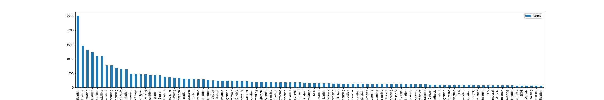
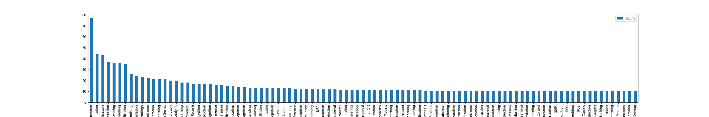
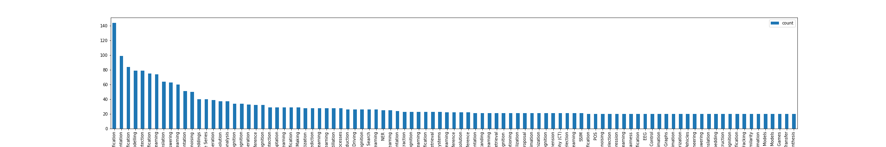

## Project description
This project is to help me get more productive when I am working on a specific topic. I want to use NLP to classify new papers on arXiv and get notification when some topics I am interested in are published.

## How to 
I like the `Paper with code` paper classification system, so I want to use this for my app/script.

The first step is to use `selenium` and `beautiful soup` to get the link to all the papers on PWC, and put information gathered so far in a file. We use `selenium` because there is a lot of use interaction going on in paper with code, which is necessary to get all the links.

The second step is to go to all the gathered link, and extract the tasks and abstract, for this I do not need `selenium`, just some http requests and beautiful soup.

Third step is to get clean up the dataset, for now, there is a notebook that take all the tasks with 100 or more papers, and do a train/val/test split of 70/20/10.

Fourth step is to train a multiclass classifier, will be using pytorch for that.

Finally, I'll make a script to get the latest arXiv papers, and probably set up a cron job to get them daily, I'll store the results in a database (either notion or i'll make a mongo DB for that)

## Dataset 
In this repo you can check `dataset_full.json` this is all the abstracts, with the relevants links, and the relevants methods/tasks/domain given by paper with code. Just use that if you want to create something of your own, there is no point in running the code in `src`

The notebook I made to split the dataset will give this kind of distribution (97 labels after filtering) 
Train set : 

Test set : 

Validation set :

## TODO's

- [ ] Function to get the papers abstract from arXiv
- [ ] Machine learning model for documents clustering
  - [ ] Training part (notebook base -> script final)
  - [ ] Inference part
- [ ] Function to upload to database
